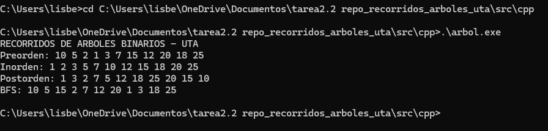
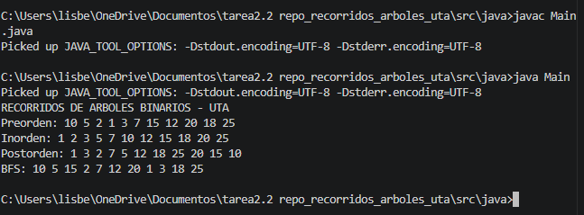
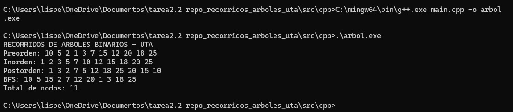
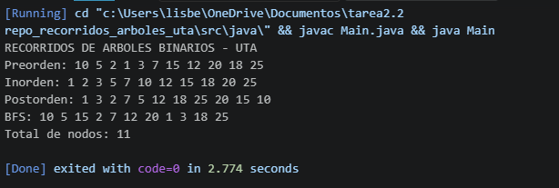
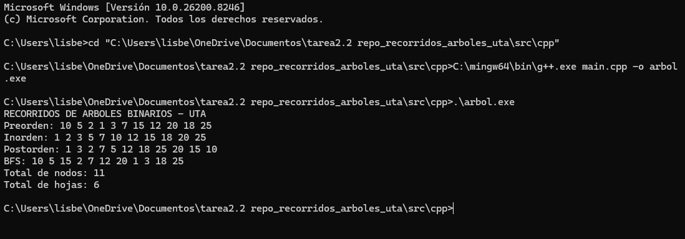
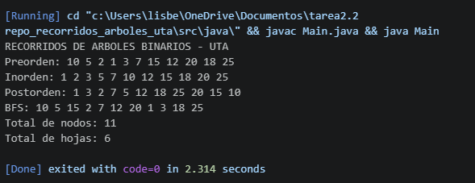

# Recorridos de Árboles Binarios - Estructura de Datos

**Universidad Técnica de Ambato**  
**Carrera:** Ingeniería de Software  
**Asignatura:** Estructura de Datos  
**Curso:** Tercero B  
**Tema:** Recorridos de árboles binarios: Inorden, Preorden, Postorden y BFS

## Objetivo general
Implementar y analizar los principales recorridos de árboles binarios utilizando C++ y Java, aplicando estructuras de datos dinámicas, recursividad y colas.

## Resultados de aprendizaje
Al finalizar la práctica, el estudiante será capaz de:

1. Explicar la diferencia entre recorridos DFS y BFS.
2. Implementar recorridos Inorden, Preorden y Postorden con recursividad.
3. Implementar BFS usando una cola.
4. Comparar la implementación en C++ y Java.
5. Aplicar recorridos de árboles a un caso real del proyecto final.

## Contenido

| Carpeta | Descripción |
|---|---|
| `docs/` | Guía práctica para la clase |
| `src/cpp/` | Implementación completa en C++ |
| `src/java/` | Implementación completa en Java |
| `exercises/` | Ejercicios para trabajo grupal |
| `moodle/` | Banco de preguntas tipo Moodle |
| `assets/` | Recursos de apoyo |

## Reglas de recorrido

| Recorrido | Orden |
|---|---|
| Inorden | Izquierda → Raíz → Derecha |
| Preorden | Raíz → Izquierda → Derecha |
| Postorden | Izquierda → Derecha → Raíz |
| BFS | Nivel por nivel usando cola |

## Ejecución en C++

```bash
cd src/cpp
g++ main.cpp -o recorridos
./recorridos
```

## Ejecución en Java

```bash
cd src/java
javac Main.java
java Main
```

## Actividad  sugerida:

1. Clonar el repositorio.
2. Ejecutar el código base.
3. Agregar mínimo 5 nodos nuevos.
4. Mostrar los cuatro recorridos.
5. Modificar el caso de aplicación al proyecto final.
6. Subir evidencias al repositorio GitHub del grupo.

## Entregables

- Captura de ejecución en consola.
- Código fuente comentado.
- README del grupo.
- Explicación del caso real.
- Link del repositorio GitHub.

## Rúbrica breve sobre 10 puntos

| Criterio | Puntaje |
|---|---:|
| Implementación correcta de recorridos | 3 |
| Uso correcto de recursividad y cola | 2 |
| Código comentado y organizado | 1.5 |
| Aplicación al proyecto final | 2 |
| Uso de GitHub e IA documentada | 1.5 |

## Resolución de ejercicios

### Ejercicio 1

Árbol dado:

```text
        10
       /  \
      5    15
     / \   / \
    2   7 12 20
```

**Preorden:** 10, 5, 2, 7, 15, 12, 20  

**Inorden:** 2, 5, 7, 10, 12, 15, 20  

**Postorden:** 2, 7, 5, 12, 20, 15, 10  

**BFS:** 10, 5, 15, 2, 7, 12, 20  

---

### Ejercicio 2

Árbol modificado con los nodos 1, 3, 18 y 25:

```text
            10
          /    \
         5      15
       /  \    /   \
      2    7  12   20
     / \           / \
    1   3        18  25
```

**Preorden:** 10, 5, 2, 1, 3, 7, 15, 12, 20, 18, 25  

**Inorden:** 1, 2, 3, 5, 7, 10, 12, 15, 18, 20, 25  

**Postorden:** 1, 3, 2, 7, 5, 12, 18, 25, 20, 15, 10  

**BFS:** 10, 5, 15, 2, 7, 12, 20, 1, 3, 18, 25  

#### Captura C++



#### Captura Java



---

### Ejercicio 3

Se implementó una función recursiva para contar la cantidad total de nodos del árbol binario.

**Resultado obtenido:**  
Total de nodos: 11

#### Captura C++



#### Captura Java



---

### Ejercicio 4

Se implementó una función recursiva para contar las hojas del árbol binario.

**Resultado obtenido:**  
Total de hojas: 6

#### Captura C++



#### Captura Java



---

## Ejercicio 5 aplicado

En el proyecto final Smart Campus, los árboles binarios pueden utilizarse para organizar módulos y procesos del sistema de forma jerárquica.

La raíz del árbol representa el sistema principal Smart Campus, mientras que los nodos hijos representan módulos específicos como gestión de usuarios, gestión académica, solicitudes y navegación dentro del campus.

Por ejemplo:

```text
             Sistema Smart Campus
             /                  \
      Gestión de Usuarios    Gestión de Recursos
        /        \              /          \
 Registrar    Buscar       Prestar      Reportes
```
Esta estructura permite organizar de manera eficiente los diferentes componentes del Smart Campus y facilita la navegación de estudiantes, docentes y trabajadores dentro del sistema.
### Explicación de recorridos

1. Para mostrar el menú principal se usaría el recorrido **Preorden**, porque primero visita la raíz y luego los submódulos.

2. Para procesar primero los módulos internos se usaría **Postorden**, porque primero procesa los hijos y finalmente el nodo principal.

3. Para mostrar módulos nivel por nivel se usaría **BFS**, porque recorre el árbol por niveles utilizando una cola.

---

## Preguntas de reflexión

### 1. ¿Qué recorrido sirve para ordenar valores en un BST?

El recorrido Inorden permite mostrar los valores ordenados de menor a mayor en un Árbol Binario de Búsqueda (BST).

### 2. ¿Qué diferencia existe entre DFS y BFS?

DFS recorre el árbol en profundidad utilizando recursividad o pila, mientras que BFS recorre el árbol por niveles utilizando una cola.

### 3. ¿Por qué BFS requiere una cola?

Porque necesita mantener el orden de visita de los nodos por niveles, procesando primero los nodos que fueron agregados antes.

### 4. ¿En qué caso real se puede usar Preorden?

Se puede usar para mostrar menús principales de un sistema o para copiar la estructura de un árbol.

### 5. ¿En qué caso real se puede usar Postorden?

Se puede usar para eliminar estructuras jeráricas o procesar submódulos antes del módulo principal.